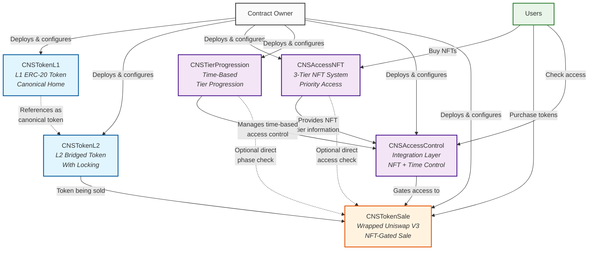

# CNS Contract Architecture

```mermaid
graph TD
    %% Core Token Contracts
    L1[CNSTokenL1<br/><em>L1 ERC-20 Token<br/>Canonical Home</em>] 
    L2[CNSTokenL2<br/><em>L2 Bridged Token<br/>With Locking</em>]
    
    %% Access Control System
    NFT[CNSAccessNFT<br/><em>3-Tier NFT System<br/>Priority Access</em>]
    TP[CNSTierProgression<br/><em>Time-Based<br/>Tier Progression</em>]
    AC[CNSAccessControl<br/><em>Integration Layer<br/>NFT + Time Control</em>]
    
    %% Token Sale Contract
    TS[CNSTokenSale<br/><em>Wrapped Uniswap V3<br/>NFT-Gated Sale</em>]
    
    %% Relationships
    
    %% L1/L2 Bridge Relationship
    L1 -.->|References as<br/>canonical token| L2
    
    %% Access Control Integration
    NFT -->|Provides NFT<br/>tier information| AC
    TP -->|Manages time-based<br/>access control| AC
    
    %% Token Sale Integration
    L2 -->|Token being sold| TS
    AC -->|Gates access to| TS
    NFT -.->|Optional direct<br/>access check| TS
    TP -.->|Optional direct<br/>phase check| TS
    
    %% User Interactions
    User[Users] -->|Buy NFTs| NFT
    User -->|Purchase tokens| TS
    User -->|Check access| AC
    
    %% Administrative
    Owner[Contract Owner] -->|Deploys & configures| L1
    Owner -->|Deploys & configures| L2
    Owner -->|Deploys & configures| NFT
    Owner -->|Deploys & configures| TP
    Owner -->|Deploys & configures| AC
    Owner -->|Deploys & configures| TS
    
    %% Styling
    classDef tokenClass fill:#e1f5fe,stroke:#01579b,stroke-width:2px
    classDef accessClass fill:#f3e5f5,stroke:#4a148c,stroke-width:2px
    classDef saleClass fill:#fff3e0,stroke:#e65100,stroke-width:2px
    classDef userClass fill:#e8f5e8,stroke:#2e7d32,stroke-width:2px
    classDef ownerClass fill:#fafafa,stroke:#424242,stroke-width:2px
    
    class L1,L2 tokenClass
    class NFT,TP,AC accessClass
    class TS saleClass
    class User userClass
    class Owner ownerClass
```
