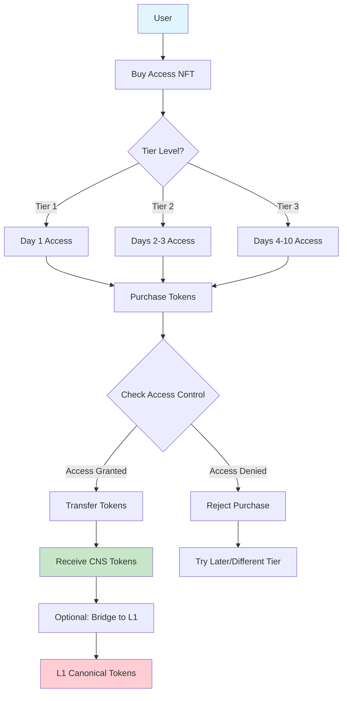

# CNS Token Sale Flow

```mermaid
flowchart TD
    A[User] --> B[Buy Access NFT]
    B --> C{Tier Level?}
    C -->|Tier 1| D[Day 1 Access]
    C -->|Tier 2| E[Days 2-3 Access]  
    C -->|Tier 3| F[Days 4-10 Access]
    
    D --> G[Purchase Tokens]
    E --> G
    F --> G
    
    G --> H{Check Access Control}
    H -->|Access Granted| I[Transfer Tokens]
    H -->|Access Denied| J[Reject Purchase]
    
    I --> K[Receive CNS Tokens]
    J --> L[Try Later/Different Tier]
    
    K --> M[Optional: Bridge to L1]
    M --> N[L1 Canonical Tokens]
    
    style A fill:#e1f5fe
    style K fill:#c8e6c9
    style N fill:#ffcdd2
```
